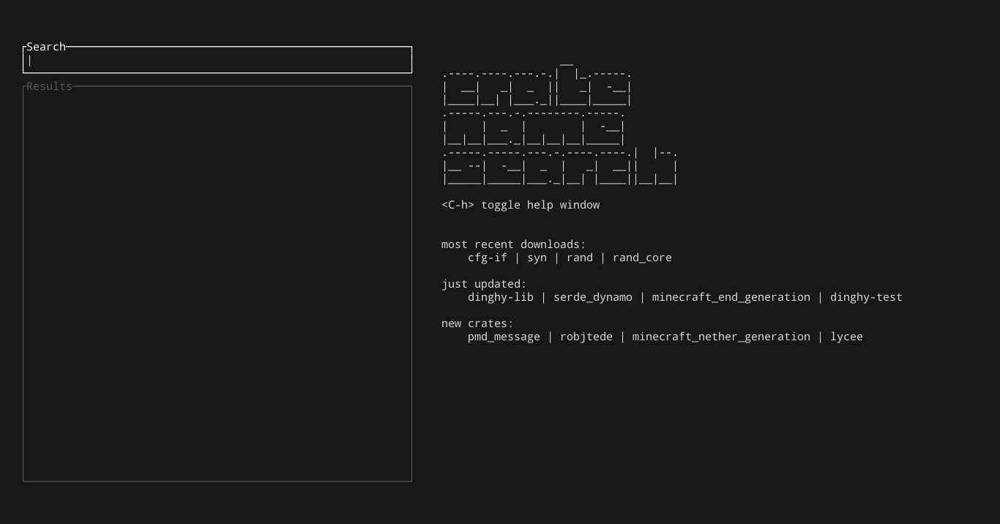

# crate name search

Search through Rust crates without leaving the terminal.

**Work in progress. Approach with caution.**




## How to install `cns`

```
cargo install cns
```

or

```
git clone https://github.com/adamsky/cns
cd ./cns
cargo run --release
```


## How to use `cns`

```
                  __
.----.----.---.-.|  |_.-----.
|  __|   _|  _  ||   _|  -__|
|____|__| |___._||____|_____|
.-----.---.-.--------.-----.
|     |  _  |        |  -__|
|__|__|___._|__|__|__|_____|
.-----.-----.---.-.----.----.|  |--.
|__ --|  -__|  _  |   _|  __||     |
|_____|_____|___._|__| |____||__|__|

<C-h> toggle this help window

# search mode
<C-s> clear input
<Enter> perform the search and focus the results block
<Escape> | <C-r> focus the results block
<C-q> | <C-c> quit

# results mode
<Escape> | <C-s> focus the search bar
<j>, <k>, <up>, <down> move up and down the results
<h>, <l>, <left>, <right> move left and right between result tabs
<C-g> go to documentation (browser)
<C-r> go to repository (browser)
<Enter> go to crate (browser)
<C-q> | <C-c> | <q> quit

```  